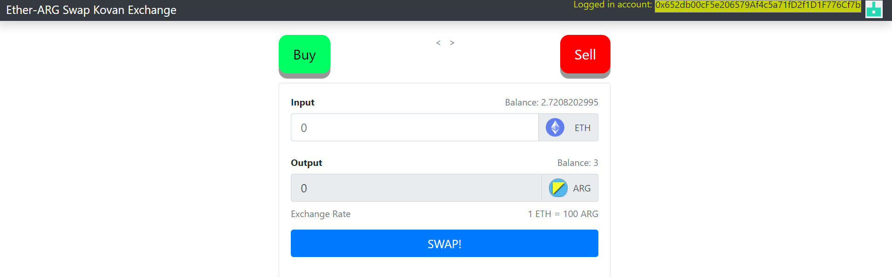
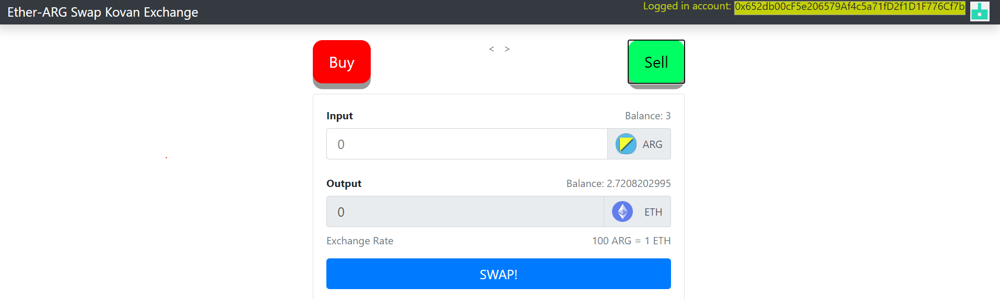

# Project ETH-ARG swap (deployed in Kovan)

[](https://docs.openzeppelin.com/)


## 1. About

This project implements a PoC for a token swap exchange application (Dapp) over Ethereum.

Final project demo web App can be seen here: [http://34.69.122.108/token-swap/](http://34.69.122.108/token-swap/)

## 2. Main features

- Two smart contracts written in Solidity:

        -> ARG (ERC20) token contract

        -> EthSwap exchange contract

- Fronted built with React.js
- Deployment to Kovan test network
- Integration to Ethereum via web3, MetaMask and infura.io
- Secrets and addresses handled by @truffle/hdwallet-provider
- Web3 events are subscribed via infura wss API


## 3. Pre requisites

In order to deploy this project as detailed above, the following pre requisites are required:

- Available API project KEY from [infura.io](https://infura.io) on KOVAN endpoint
- Kovan Ether tokens *holder account* (may be requested via this faucet: <https://faucet.kovan.network/>)
- Metamask enabled on browser

## 4. Framework and dependencies

- Source code language: Solidity
- Development environment: Node.js / NPM / Truffle / DotEnv / Truffle-hdwallet / React.js
- Ethereum client: <https://infura.io>
- MetaMask Wallet

## 5. Usage

```bash
$ git clone https://github.com/alejoacosta74/token-swap-exchange.git token-swap-exchange
$ cd token-swap-exchange
## install truffle (if not installed)
$ npm install -g truffle
## install dependencies
$ npm install
$ truffle init
$ truffle compile
## deploy smart contracts to Kovan
$ truffle migrate --network kovan
## start local development React server
$ npm start
```
## 6. Access Dapp and deployed contracts

- Deployed contracts

This project is deployed at Kovan at the following addresses:

ARG token: [0x72B64B69315e6de186aD2C450781b408aACDbdcB](https://kovan.etherscan.io/address/0x72b64b69315e6de186ad2c450781b408aacdbdcb)

EthSwap contract: [0x36D66f8fC414c7c96C9d5d9526c4440D5185578d](https://kovan.etherscan.io/address/0x36d66f8fc414c7c96c9d5d9526c4440d5185578d)

- Accesing the Dapp

Visit: [http://34.69.122.108/token-swap/](http://34.69.122.108/token-swap/)

- Dapp screen shots

*Buy*



*Sell*

